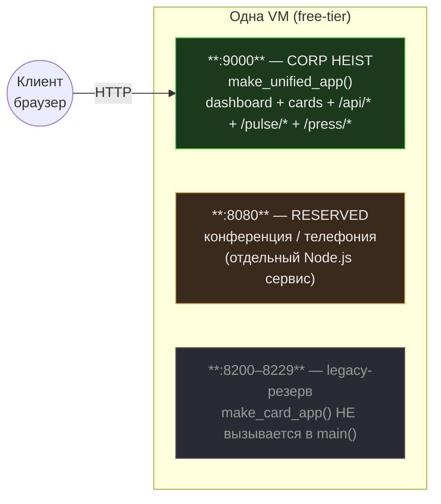
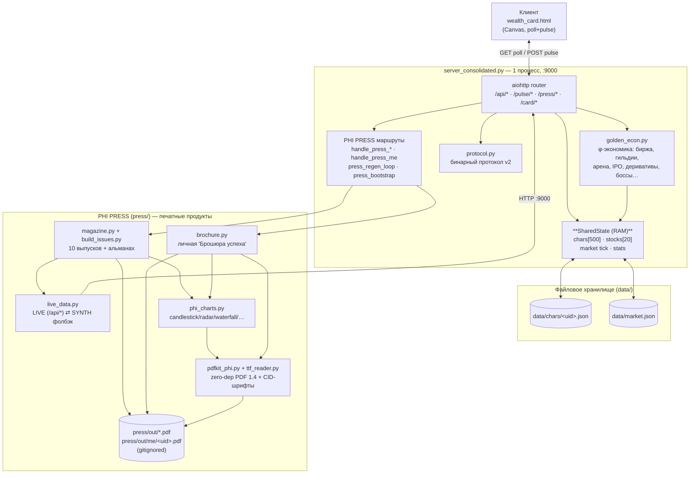
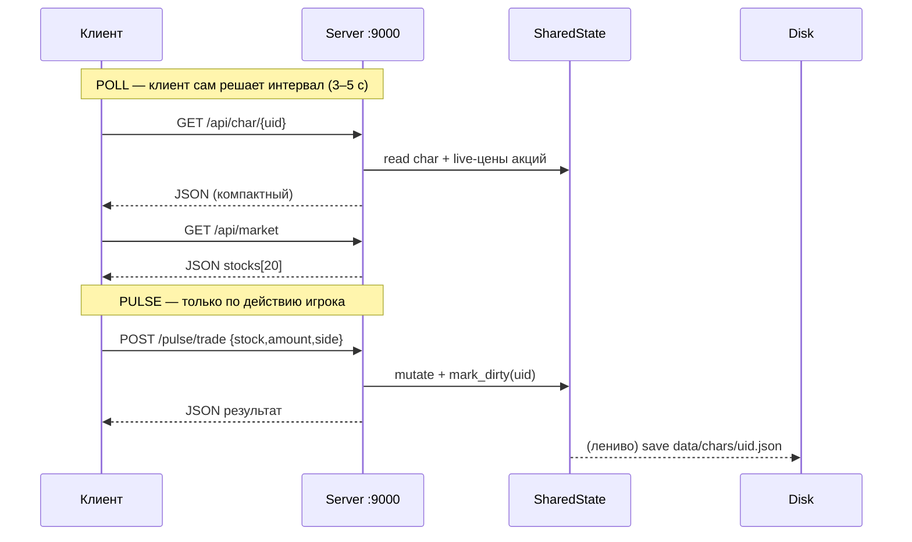
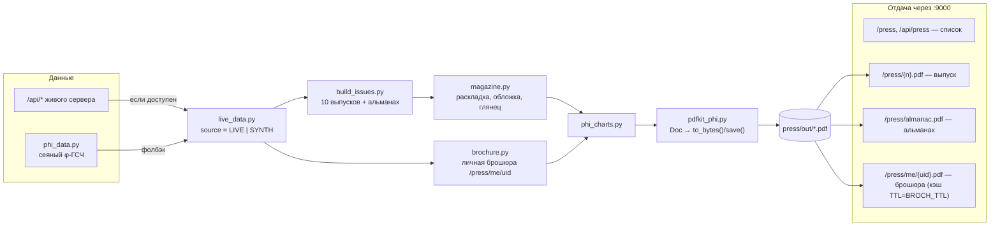
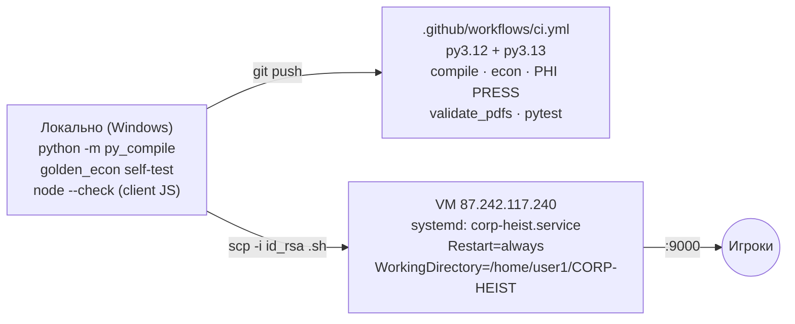

# CORP HEIST — Architecture & Design Notes

> Краткая карта проекта: **как всё устроено, какие парадигмы заложены, где что
> искать**. Про игру-контент см. `README.md`. Здесь — только про *устройство*.
> Диаграммы — Mermaid (рендерятся прямо в GitHub, версионируются как текст, вес ~0).

Актуально на: 2026. Источник истины — код; при расхождении верь коду, потом правь этот файл.

---

## 0. TL;DR (что помнить в первую очередь)

- **⛔ ГЛАВНЫЙ ЛИМИТ: ≈ 30 постоянных коннектов.** Больше — память переполняется,
  Linux уходит в OOM и машина падает. Вокруг этого построен весь транспорт
  (см. §4 и `docs/CALCULATIONS.md`).
- **Один процесс, один внешний порт `9000`.** Всё (дашборд + карточки + API +
  pulse + PHI PRESS) отдаётся `make_unified_app()` на `CMD_PORT=9000`.
- **Порт `8080` НЕ трогать** — зарезервирован под конференцию/телефонию
  (отдельный Node.js сервис на той же VM).
- **`8200–8229` — legacy-резерв**, в текущем `main()` НЕ биндятся (см. §2).
- **Транспорт: Pulse + Poll, без WebSocket.** `GET /api/*` (poll) + `POST /pulse/*` (action).
- **Хранилище — файловое JSON**, без БД: `data/chars/<uid>.json`, `data/market.json`.
- **Ноль внешних ассетов.** Вся графика — вектор/математика (Canvas в HTML, PDF-движок в PHI PRESS).
- **Ноль обязательных рантайм-зависимостей у PDF-движка.** Кириллица — вшитый subset Arial.
- **Всё масштабируется по φ = 1.618033988749** (золотое сечение — сквозная эстетика и раскладки).
- **Стоимость хостинга — 0 ₽.** Влезает в бесплатный тариф (~52 MB RAM).
- **Compliance:** 14-ФЗ, 39-ФЗ, 152-ФЗ, 149-ФЗ; 12+. Донат = благодеяние, возврата денег нет.

---

## 1. Заложенные парадигмы

| Принцип | Как реализовано | Зачем |
|---|---|---|
| **⛔ Лимит ~30 коннектов** | Короткие pulse/poll-запросы, никаких висящих соединений, состояние не в коннекте | Больше постоянных коннектов → OOM → падение Linux |
| **Низкий трафик** | Pulse+Poll, компактный JSON, бинарный `protocol.py` для тяжёлых пакетов | Дёшево, влезает в free-tier, тянет 10K клиентов |
| **Единый процесс** | `SharedState` в памяти, 0 IPC между «инстансами» | Latency 0 мс, 0 байт между картами |
| **Свободные порты с резервом** | Внешний только `9000`; `8080` отдан конференции; `8200–8229` — запас | Не конфликтовать с соседними сервисами на VM |
| **Zero-dependency где можно** | Свой PDF-движок, свой TTF-парсер, свой binary protocol | Не зависеть от версий пакетов на бесплатном хосте |
| **Zero-asset графика** | Canvas (HTML) + векторный `pdfkit_phi` | Нет бинарных картинок в git, всё детерминировано |
| **Детерминизм / offline** | `phi_data` (сеяный ГСЧ), `live_data` с synth-фолбэком | Магазин/брошюры собираются даже без живого сервера |
| **φ-эстетика** | `PHI` в раскладках, спиралях, сетках, градациях | Единый «золотой» визуальный язык |
| **Файловое состояние** | JSON per-char + market.json, `_dirty`-флаги | Нет БД, простой бэкап (`tar` папки `data/`) |
| **Compliance-by-design** | Донат=благодеяние, награды только игровое золото, оператор платит налоги | 14/39/152/149-ФЗ, 12+ |

---

## 2. Порты (важно, легко забыть)



Факты из кода (`server_consolidated.py`):
- `CMD_PORT = 9000` — единственный реально биндящийся порт.
- `CARD_PORTS = range(8200, 8230)`, `make_card_app`, `make_dashboard_app` —
  **legacy, в `main()` не используются** (осталось от старой 30-процессной модели).
  `main()` делает `run_port(make_unified_app(), CMD_PORT)` и всё.
- `8080` — только комментарий-напоминание, сервер его не открывает.

> ⚠️ Старые `SERVER_ARCHITECTURE.txt` / `DEPLOY.md` местами описывают устаревшую
> мульти-портовую модель (8200-8229 как активные). Это неактуально — верь этому файлу.

**Почему один порт, а не 30 (в порядке важности):**
1. **Главное — лимит ~30 постоянных коннектов.** Много портов провоцирует держать
   висящие соединения; сверх лимита → OOM → падение Linux. Один порт + короткие
   pulse/poll-запросы держат число коннектов под потолком. (Детали — §4 и
   `docs/CALCULATIONS.md`.)
2. Порты **не дают** производительности: параллелизм обеспечивает один event loop
   (asyncio) и от числа портов не зависит; Python GIL всё равно не даёт
   CPU-параллелизма в одном процессе. «Карта = порт» была лишь адресацией.
3. Плюс чистота и резерв: свободен весь диапазон 8200–9999.

> ⚠️ **Противопоказано ради «разгрузки»:** multi-worker / SO_REUSEPORT / много
> портов — они плодят постоянные коннекты и гарантированно уронят машину.
> Масштаб — только короткими запросами и (если нужно) отдельными VM + Redis.

---

## 3. Компоненты (component diagram)



---

## 4. Транспорт: Pulse + Poll (без WebSocket)



Почему не WebSocket (главное — коннекты, не трафик): WebSocket держит **1
постоянный коннект на каждого онлайн-игрока** → при лимите ~30 машина падает почти
сразу. Pulse/poll закрывает коннект сразу после ответа, поэтому число одновременных
соединений ≈ `RPS × длительность_ответа` (единицы, а не тысячи) и остаётся под
потолком. Плюс: idle-соединения жрут RAM (~8 KB/conn), нужна логика переподключений;
pulse/poll проще и без состояния соединения. Полные расчёты — `docs/CALCULATIONS.md`.

---

## 5. PHI PRESS — печатная подсистема

Отдельный слой: генерирует **глянцевые PDF** (игровые журналы, личные брошюры,
альманах) для соц-флекса. Не меняет игровую механику.



Ключевое:
- **`pdfkit_phi.py`** — рукописный PDF 1.4, кириллица через `CIDFontType2` +
  `ToUnicode`, шрифт — subset Arial (`press/fonts/heist-sans*.ttf`, закоммичены).
  Рантайму `fontTools` НЕ нужен (нужен только для пересборки subset — `make_subset.py`).
- **`live_data.LiveData().source`** = `"LIVE"` или `"SYNTH"` — так видно, откуда данные.
- **Фоновая регенерация**: `press_regen_loop()` каждые `PRESS_REGEN_HOURS` (по умолч. 6);
  `press_bootstrap()` строит synth-набор при старте, если PDF отсутствуют.
- **PDF — артефакты**, в git не хранятся (`.gitignore`: `press/out/*.pdf`,
  `press/out/me/*.pdf`). Поэтому git на сервере остаётся чистым после регенерации.
- Личная брошюра строится на лету из `STATE.chars[uid]` + `trader_badges` + ранг,
  кэшируется в `press/out/me/<uid>.pdf` на `BROCH_TTL` (по умолч. 300 c),
  рендер идёт в executor (не блокирует event loop).

---

## 6. Deployment



- SSH-ключ: `id_rsa` (gitignored). Деплой-скрипты кладём в temp, `scp` → `ssh bash`.
- На сервере **нет `curl`** — проверки через `python3 urllib`.
- systemd-юнит: `/etc/systemd/system/corp-heist.service`.
- Подробный чек-лист — `DEPLOY.md` (порты в нём частично устаревшие, см. §2 здесь).

---

## 7. Где что искать (карта файлов)

| Хочу… | Файл |
|---|---|
| Главный сервер, все маршруты, SharedState | `server_consolidated.py` |
| Экономику (биржа, гильдии, IPO, боссы…) | `golden_econ.py` |
| Бинарный протокол | `protocol.py` |
| Клиент-карточку (Canvas, poll/pulse, кнопка PRESS) | `wealth_card.html` |
| PDF-движок (zero-dep, CID-шрифты) | `press/pdfkit_phi.py` |
| Парсер TTF | `press/ttf_reader.py` |
| Пересобрать subset-шрифт | `press/make_subset.py` (нужен fontTools) |
| φ-синтетические данные | `press/phi_data.py` |
| Все графики (свечи, radar, waterfall…) | `press/phi_charts.py` |
| Раскладка журнала | `press/magazine.py` |
| Сборка 10 выпусков + альманаха | `press/build_issues.py` |
| Живые/synth данные для прессы | `press/live_data.py` |
| Личная брошюра успеха | `press/brochure.py` |
| CI | `.github/workflows/ci.yml`, `.github/validate_pdfs.py` |
| Тесты | `tests/test_protocol.py`, `tests/test_bridge.py` |
| Расчёты (трафик, RAM, лимит коннектов) | `docs/CALCULATIONS.md` |
| Деплой | `DEPLOY.md`, `docs/ARCHITECTURE.md` (этот файл) |
| Старые заметки (legacy, частично неверные порты) | `SERVER_ARCHITECTURE.txt`, `ARCHITECTURE.txt` |
| Хранилище (runtime) | `data/chars/*.json`, `data/market.json` |

---

## 8. Переменные окружения

| Env | По умолчанию | Что делает |
|---|---|---|
| `PRESS_REGEN_HOURS` | `6` | Интервал фоновой регенерации выпусков |
| `BROCH_TTL` | `300` | TTL кэша личной брошюры (сек) |
| `PRESS_SYNTH` | — | `=1` — принудительно детерминированная synth-сборка прессы |
| `CORP_HEIST_API` | `http://localhost:9000` | База для `live_data` (откуда пресса тянет LIVE) |

---

## 9. Быстрые проверки (smoke)

```bash
# компиляция сервера
python -m py_compile server_consolidated.py golden_econ.py

# самотест экономики (RC=0)
python golden_econ.py

# собрать прессу детерминированно и проверить PDF
$env:PRESS_SYNTH="1"; python press/build_issues.py
python .github/validate_pdfs.py         # 11 файлов, маркеры + 2 CID-шрифта

# тесты протокола/моста
python tests/test_protocol.py
python tests/test_bridge.py
```

Маркеры валидного PDF: `%PDF-1.4`, `%%EOF`, `/Root`, `startxref`,
`/Subtype /Type0` (должно быть 2 CID-шрифта: обычный + жирный).

---

## 10. Инварианты (не сломать)

1. **≤ ~30 постоянных коннектов.** Никаких WebSocket / висящих соединений /
   multi-worker / многопортовости ради «разгрузки» — иначе OOM и падение Linux.
   Только короткие pulse/poll-запросы.
2. Внешний порт всегда один — `9000`. `8080` не занимать.
3. PDF не коммитить (они в `.gitignore`); git на сервере должен быть чистым.
4. Рантайм не должен требовать `fontTools` / бинарных ассетов.
5. Пресса обязана собираться offline (synth-фолбэк) — не завязывать сборку жёстко на живой API.
6. Донат — благодеяние, награды только игровое золото, возврата денег нет (compliance).
7. Всякий новый визуал — вектор/математика, масштабирование по φ.
