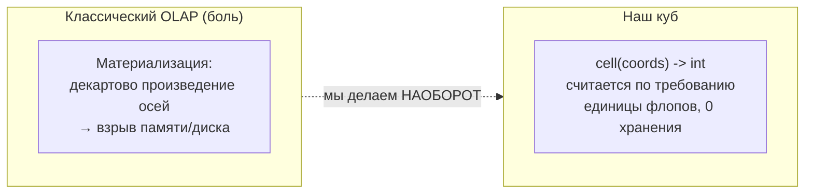
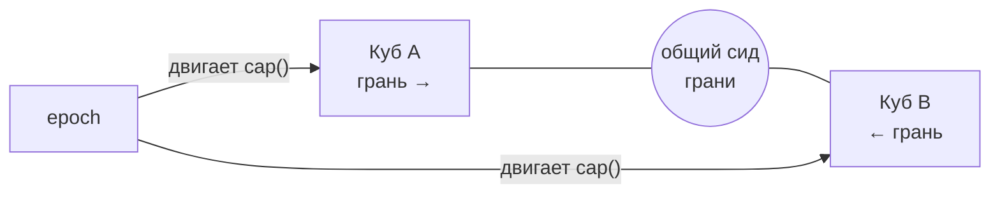
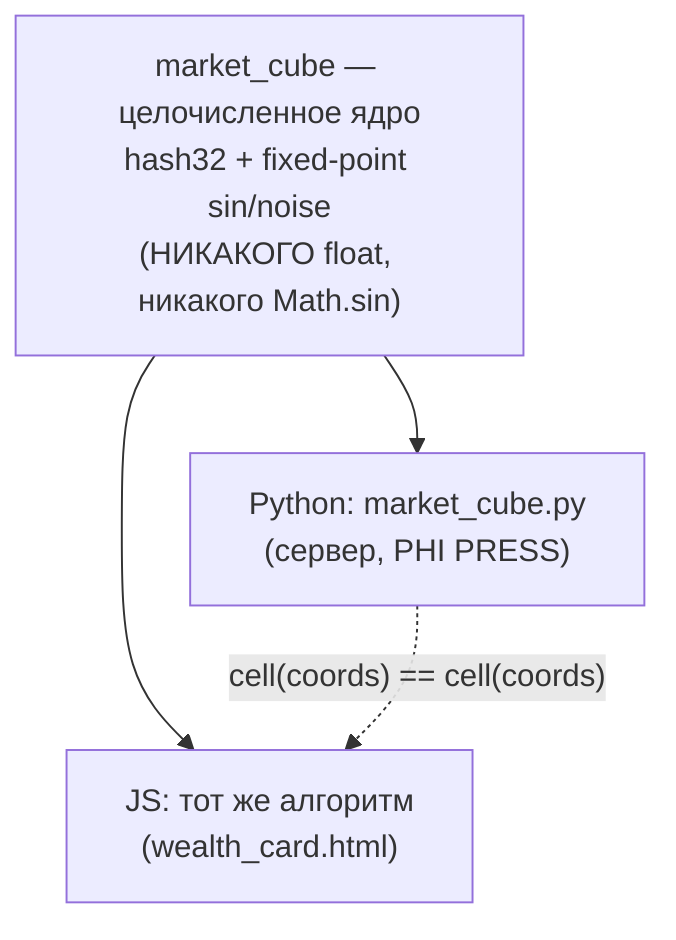
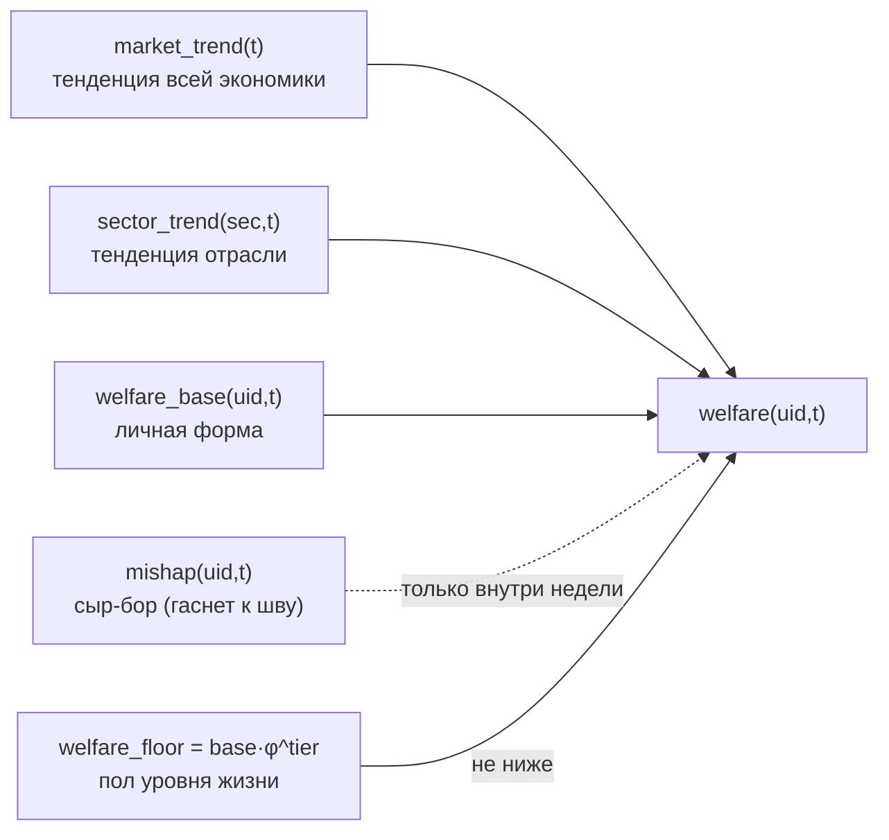
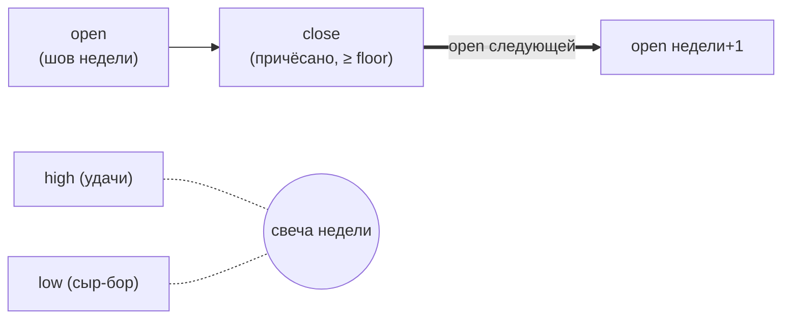

# CORP HEIST — Игра как OLAP-куб (детерминированное поле)

> Фундаментальная модель мира. Всё остальное (`ARCHITECTURE.md`,
> `CALCULATIONS.md`) — следствия отсюда. Читать первым, если хочешь понять «почему
> так устроено», а не «что где лежит».

---

## 0. Одна фраза

**Игра — это не база записей, а многомерное поле (OLAP-куб), где любая ячейка не
хранится, а вычисляется по координатам детерминированной функцией. Куб никогда не
материализуется целиком — только точечно, на клиенте, по требованию.**

Отсюда: 0 хранения истории, ~0 рыночного трафика, коннекты короткие, машина не
падает, будущее «предсказуемо, но неожиданно».

---

## 1. Оси куба (4 + 1) и массив кубов

Поле — это **массив кубов, состыкованных по границам** (не монолит). Появляется
ось `cube` (домен поля): рынок, боссы, аукцион, прогресс/сила…

| # | Ось | Что это | Пример значений |
|---|---|---|---|
| 0 | **cube** | домен поля | `MARKET`, `BOSS`, `AUCTION`, `POWER` |
| 1 | **entity** | сущность/символ | акция `ALPHA`, корпорация, лот аукциона |
| 2 | **t** | время (сек от эпохи Unix) | прошлое и будущее считаются одинаково |
| 3 | **subject** | чей срез смотрим | `uid` игрока (0 = общий/рыночный) |
| 4 | **measure** | какая метрика | `price`, `volume`, `spread`, `boss_hp`, `robot_target` |
| +1 | **epoch** | слой сида (n) | двигает всю сетку И все допуски |

**Ячейка:**

```
cell(cube, entity, t, subject, measure, epoch) -> int   (в пределах допуска)
```

Все `price / volume / spread / …` — разные `measure` над **одним** ядром. Одно
целочисленное ядро (хеш + fixed-point математика), меры — тонкие обёртки.

«Хотя если получится — одна функция»: идеал — единое ядро; реальность —
**массив кубов** с общим ядром, но своими допусками и стыками.

---

## 2. Ключевой трюк: куб виртуален



- «Сам знаешь как у нас с кубами» — классический куб взрывается при
  материализации. **Мы его не материализуем никогда.**
- Ячейка считается за единицы операций там, где на неё смотрят.
- Прошлое и будущее — просто разные `t`; рисование истории = выборка ячеек по сетке `t`.

---

## 2b. Допуски (пределы) и стык кубов

Каждая мера каждого куба имеет **допуск** — потолок значения, растущий по эпохам.
Метафора-якорь: экзоскелет — человек поднимал 5 кг, «технологическое
совершенствование» → 5 тонн. Потолок это не константа, а функция эпохи.

```
cap(cube, measure, epoch) = base(cube, measure) · φ^tier(epoch)
```

Каждая эпоха = новая «технология» → потолок прыгает в φ раз (золотая прогрессия).
5 кг → ~5 т ≈ 14 ступеней φ, т.е. десяток эпох роста.

Три класса допусков:

| Класс | Поведение | Примеры |
|---|---|---|
| **HARD** | жёсткий предел, растёт только при смене эпохи | грузоподъёмность, HP-кап босса |
| **SOFT** | значение подходит к потолку асимптотически внутри эпохи | цена, объём |
| **BONUS** | временный расширитель поверх cap (подарок/событие даёт +tier на срок) | «экзоскелет», крючок под подарки |

Эпоха — детерминированная функция времени:

```
epoch(t) = (t - GENESIS) / EPOCH_LEN        (целочисленно)
```

Прошлое зафиксировано, текущая считается, дальняя закрыта горизонтом. 0 хранения.

**Стык кубов:** соседние кубы делят граничную ячейку (общий сид грани) → значение
на стыке совпадает у обоих. Поле бесшовно, стык тоже вычисляется, не хранится.



---

## 3. Детерминизм: сервер = клиент, бит-в-бит



- Идентичность обязана быть **точной** → только целочисленная математика на
  фиксированной точке. Плавающая точка (float / `Math.sin`) даёт расхождения
  округления между Python и JS — **запрещена в ядре куба.**
- Тест на совпадение: одинаковый набор координат → одинаковые `int` в Py и JS.
- Сервер всегда «знает, что творится», потому что **считает по той же функции**,
  а не хранит и не синхронизирует.

---

## 4. Роботы «знают ответ»

Это разрешение главного противоречия («формула зашита → игрок знает будущее»).

- Формула детерминирована и зашита в клиент → будущее в принципе вычислимо.
- **Но это не ломает рынок**, потому что **цена не зависит от сделок игрока**
  (`measure=price` — чистая функция; сделка ни на что не влияет).
- **Роботы — агенты внутри куба, которые уже знают ответ** (значение будущей
  ячейки `robot_target`). Они торгуют «правильно», задают эталон, создают объёмы,
  вбросы, движение котировщика — **всё вычисляемо, 0 трафика.**
- Игрок соревнуется **не с формулой, а с роботами**: успеть прочитать тренд
  раньше них и до закрытия окна. Непредсказуемость — в скорости/точности чтения
  игроком, а не в самой цене.

> Итог: мир детерминирован (роботы знают ответ), человек играет на **скорости и
> качестве прогноза**. «Абсолютно предсказуемо, но неожиданно.»

---

## 5. Что «втиснуто» в куб (вместо трафика)

Всё наблюдаемое — меры над одним ядром, а не пакеты по сети:

| measure | Смысл | Вместо чего |
|---|---|---|
| `price` | цена сделки/графика | `history[150]`, котировки |
| `spread` | bid/ask котировщика | синка стакана |
| `volume` | объём торгов | поля объёмов |
| `auction` | лоты/ставки | синка аукциона |
| `corp` | вбросы корпораций | случайных событий |
| `bots` | дрожь роботов | тиков рынка |
| `robot_target` | «ответ» роботов | серверной ИИ-логики |
| `boss_hp` | HP мирового босса | хранимых порогов |
| `capital` | кривая капитала игрока | `history[150]` в char |
| `welfare` | уровень благополучия игрока | «прогресс-бар» состояния |

---

## 5b. Благополучие игрока — уровень жизни как биржевая котировка

> Отдельная мера `welfare` (уровень жизни / благосостояние) — тоже **чистая
> функция куба**, 0 хранения. Считается из `(uid, sector, t)`, parity Py↔JS.
> Это «сальдовая ведомость» игрока: сколько он реально держит относительно
> детерминированного эталона своей эпохи, сектора и рынка.

### 5b.1 Два слоя: эталон и личная рябь

Благополучие устроено как **два независимых слоя**, и это принципиально:

| Слой | Что это | Кто «видит» | Хранение |
|---|---|---|---|
| **Эталон** | тренд рынка/сектора, ступень уровня жизни, пол (floor) | роботы/эксперты, все | 0 (чистая функция) |
| **Личная рябь** | мелкие удачи/неудачи игрока (`mishap`) — «сыр-бор» | только сам игрок | 0 (чистая функция) |

**Мелкие жизненные неудачи игрока НЕ проникают в эталон.** Робот-эксперт
котирует уровень невозмутимо: `market_trend`, `sector_trend`, `robot_target`,
`living_tier` считаются **только из куба** и не принимают на вход личные события.
Личная рябь живёт в отдельном, ограниченном, **самозатухающем** члене.

### 5b.2 Иерархия свёрток: рынок → сектор → игрок



Тренд — детерминированная **свёртка ячеек цены** за неделю (наклон среднего по
группе тикеров на швах), а не сохранённая история:

```
_agg_price(tickers, t) = среднее price(sym, t) по группе
trend_q16(tickers, t)  = (agg(шов) − agg(шов−неделя)) · 65536 / agg(шов−неделя)   [клип ±0.5]
market_trend(t)        = trend_q16(ВСЕ тикеры, t)
sector_trend(sec, t)   = trend_q16(тикеры сектора, t)
```

### 5b.3 Уровень жизни — замкнутая формула (для дотошных)

`living_tier` считается **напрямую из `t`**, без итераций по всем прошлым неделям
(«дотошный» подставит `uid, t` и получит ровно то же число):

```
trend_bump(uid, t) = знак(Σ по K=4 неделям [market_trend + sector_trend])   → шаг в [−1 .. +2]
living_tier(uid, t) = max(0, epoch(t) + trend_bump(uid, t))
```

Ступень меняется **только на швах недели** (bump читает значения, привязанные к
шву), внутри недели постоянна — это и есть «причёсывание в конце недели».

**Асимметрия — смена уровня жизни:** устойчивый рост легче поднимает ступень
(до +2), падение опускает медленнее (до −1). Пол текущей ступени:

```
welfare_floor(uid, t) = (base/4) · φ^living_tier(uid, t)
```

Просадка рынка не пробивает пол; но **устойчивый спад опускает саму ступень** —
это реальная смена уровня жизни, а не мгновенный обвал.

### 5b.4 «Сыр-бор»: личные неудачи, которые забываются

```
mishap(uid, t) = value_noise(личный сид, t) · амплитуда · window(t)
window(t): треугольное окно недели — 0 на швах, максимум в середине
```

- Внутри недели может быть и минус, и плюс (проиграл дуэль / удачный трейд).
- **Вес гаснет к шву → 0**: «если отрицательное — все захотят забыть».
- Никогда не роняет ниже `floor`; **не подаётся** в тренд/tier/robot_target.

> «Сыр-бор должен иметь положительное окончание, а если отрицательное — забыть.»
> Реализовано: `close` недели причёсан к эталону и ≥ floor, `mishap` самозатухает.

### 5b.5 Котировка welfare — биржевая свеча (OHLC)

Благополучие квотируется **как акция**: у недели есть цена открытия и закрытия.

```
welfare_candle(uid, week) → { o, h, l, c, tier, floor, up }
    o (open)  = welfare на шве начала недели   (эталон, чисто)
    c (close) = причёсанный итог недели         (позитивное окончание, ≥ floor)
    h (high)  = лучший внутринедельный welfare   (удачи)
    l (low)   = худший внутринедельный welfare    (сыр-бор — но забытый в close)
welfare_quotes(uid, t, n) → лента n недельных свечей (close[i] = open[i+1])
```



### 5b.6 Сальдо и аудит

```
welfare_saldo(uid, t0, t1)  = welfare(t1) − welfare(t0)        сальдо за период
welfare_report(uid, t, n)   = ведомость по n неделям {start,end,mean,saldo,tier,floor}
welfare_explain(uid, t)     = ВСЕ члены формулы (base, тренды, bump, tier, floor, mishap, raw, итог)
```

`welfare_explain` — полная прозрачность для «дотошного»/регулятора: каждый
промежуточный член предъявляется и перепроверяется. Parity Py↔JS = доказательство
детерминизма.

---

## 6. Квоты и пределы (поле с границами)

| Ресурс | Квота / предел | Механизм |
|---|---|---|
| Материализация куба | **0 ячеек хранится** | считается по требованию |
| Рыночный трафик | **0 байт** | ячейки — чистые функции |
| Синк игрока | **1 раз / 5 минут** | базовая бесплатная квота (рефреш страницы) |
| Постоянные коннекты | **≤ ~30** | короткие запросы, куб на клиенте |
| Горизонт прогноза | **до конца текущей epoch** | ось +1 (сид эпохи) закрывает дальнее будущее |
| Хранится на сервере | **только личное сальдо** | gold/xp/loot игрока, < 1 KB |

---

## 7. Монетизация — щедростью, не трафиком

Смелая идея-политика (следствие пустой сети):

> **«Выдать больше подарком, чем гонять трафик.»**
> Экономия трафика = бюджет на щедрость. Ценность даётся локально и щедро; сеть
> почти пустая.

- Базовый рефреш раз в 5 мин — бесплатно, этого хватает.
- Заработок/вовлечение — через **донат-карточку, розыгрыши, подарки**, а НЕ через
  частоту обновления. Люди любят подарки.
- Всё в рамках compliance: донат = благодеяние, награды — игровое золото, возврата денег нет.

---

## 8. Инварианты куба (не сломать)

1. Куб **не материализуется** — только `cell()` по требованию.
2. Ядро — **только целочисленная математика** (никакого float/`Math.sin`);
   Python и JS обязаны совпадать бит-в-бит (есть тест).
3. `measure=price` — **чистая функция(координат)**; сделки цену не двигают.
4. **0 байт рыночного трафика.** Любой рыночный синк по сети — нарушение.
5. Роботы вычисляемы (0 хранения) и «знают ответ» — они эталон, а не серверная ИИ.
6. Дальний прогноз ограничен горизонтом epoch (ось +1).
7. Монетизация — подарками/розыгрышами, не частотой обновления.
8. Значение ячейки всегда `clamp` в свой `cap(cube, measure, epoch)`.
9. Допуски растут по эпохам ступенями φ; BONUS — временный расширитель (подарки).
10. Соседние кубы совпадают на общей грани (стык вычисляется, не хранится).
11. `welfare` — чистая функция `(uid, sector, t)`; эталон (тренд/tier/floor)
    **не принимает** личные события игрока.
12. `mishap` (личная рябь) самозатухает к шву недели и **никогда** не пробивает
    `welfare_floor`; в тренд/`robot_target` не подаётся.
13. `living_tier` вычисляется **замкнуто** из `t` (окно K недель), без итераций
    от genesis; `welfare_explain` предъявляет все члены формулы.

---

## 9. Реализация (карта)

| Слой | Файл | Статус |
|---|---|---|
| Ядро куба (Python) | `market_cube.py` | ГОТОВО (int-математика, cell/cap/epoch, меры) |
| Ядро куба (JS-двойник) | `market_cube.js` | ГОТОВО (Math.imul, зашитая SIN_TABLE) |
| Благополучие (welfare/candle) | `market_cube.{py,js}` | ГОТОВО (тренд→сектор→игрок, mishap, OHLC) |
| Тест идентичности Py↔JS | `tests/test_cube_parity.{py,js}` | ГОТОВО (2071 проверка, бит-в-бит, в CI) |
| Цены/`history` из куба (сервер) | `server_consolidated.py` | ГОТОВО (`tick_market`, `/api/char`) |
| Инлайн `market_cube.js` в клиент | `server_consolidated.py`, `wealth_card.html` | ГОТОВО |
| Пресса на ячейках куба | `press/phi_data.py` | ГОТОВО (цены из куба) |
| API благополучия `/api/welfare/{uid}` | `server_consolidated.py` | позже |
| Свечи welfare на карточке/в PDF | `wealth_card.html`, `press/brochure.py` | позже |
